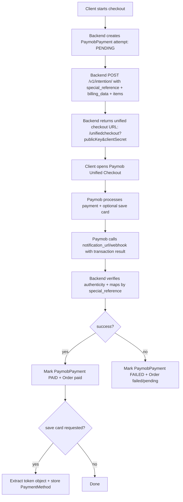
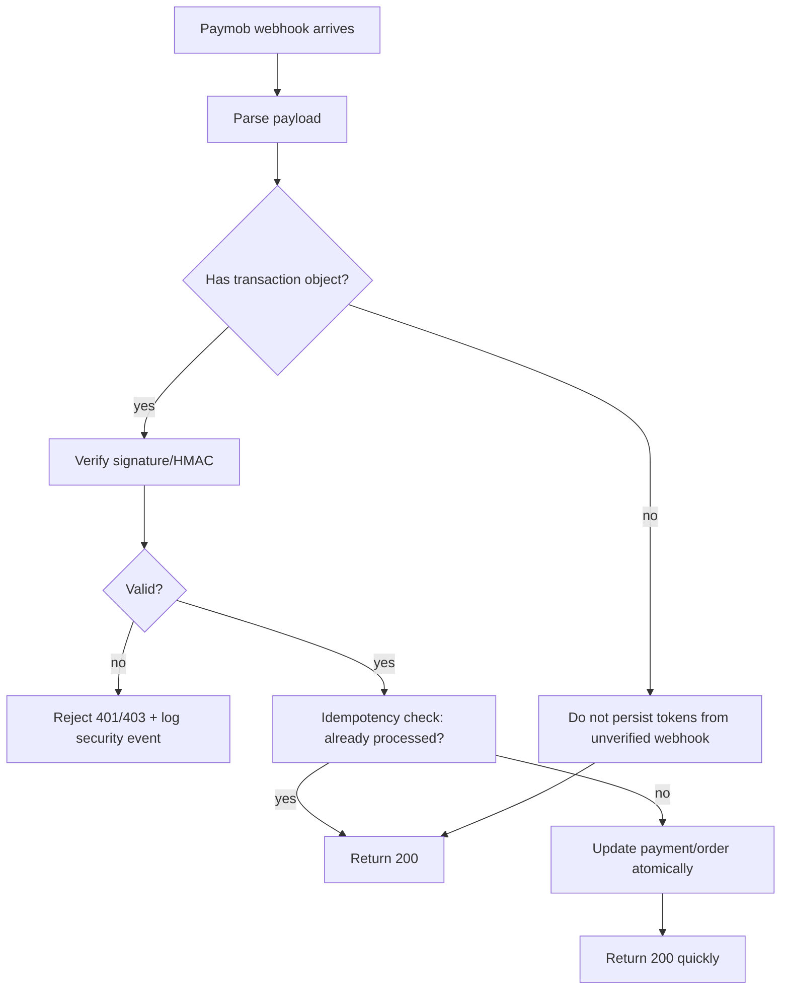

# Paymob Tokenization Code Review and A–Z Integration Guide

## Executive summary

The attached code is **PHP (Laravel)** and implements **three overlapping Paymob stacks at the same time**: (a) the legacy **Accept “classic iframe” flow** (`/api/auth/tokens` → `/api/ecommerce/orders` → `/api/acceptance/payment_keys` → iframe), (b) the newer **Intention + Unified Checkout** flow (`POST /v1/intention/` using **Secret Key** and then redirecting to `/unifiedcheckout` using **Public Key + client_secret**), and (c) an attempt at **token/MOTO** payments via `POST /api/acceptance/payments/pay` (saved token + payment_token). The Intention payload and Unified Checkout URL format in your `PaymobService::createIntention()` is broadly aligned with Paymob’s published examples (amount/currency/payment_methods/items/billing_data/special_reference/notification_url/redirection_url). citeturn17view0turn32view0

However, the current implementation has **multiple correctness bugs that will break production** (including a **syntax-breaking comment block inside `PaymentMethod.php`**, several **undefined properties**, and at least one **method call with missing required argument**). It also has **high security risk** around token webhooks (skipping authenticity checks) and **significant redundancy** (duplicate Paymob calls creating orphan Paymob orders, plus duplicated webhook/token handlers and duplicated status endpoints). 

At a high level, the remediation should focus on:
- **Pick one authoritative flow per payment method** (recommended: Unified Checkout (Intention) for Cards + tokenization; legacy Accept only for wallets/kiosk if you still need them).
- **Make your backend authoritative**: rely on the **transaction notification** (server-side callback) for final status, and treat redirects as UX only.
- **Fix database integrity** (store `user_id`, store the *exact* Paymob correlation reference used in callbacks, add unique constraints for idempotency).
- **Secure tokenization**: never persist saved card tokens based on an unverified webhook; only persist tokens when tied to a verified Paymob transaction success.
- **Harden operational behavior** (idempotency, retry discipline, logging/redaction, monitoring, tests).

Tokenization reduces exposure to PAN, but it **does not eliminate PCI DSS obligations**; token systems still require strong controls and monitoring. citeturn37view0turn37view1turn37view2

## Architecture and flow validation

### What Paymob expects conceptually for Intention, Unified Checkout, and MOTO

**Create Intention (server):** Paymob’s published Postman example shows:
- `POST https://accept.paymob.com/v1/intention/`
- Header: `Authorization: Token <Secret_Key>`
- Body includes `amount`, `currency`, `payment_methods` (integration IDs), `items`, `billing_data`, optional `extras`, `special_reference`, and (for cards) `notification_url` and `redirection_url`. citeturn17view0

**Redirect to Unified Checkout (client):** Build:
- `https://accept.paymob.com/unifiedcheckout/?publicKey=<PublicKey>&clientSecret=<client_secret>` citeturn17view0turn32view0

**MOTO / pay with saved token:** Paymob’s example shows:
- `POST https://accept.paymob.com/api/acceptance/payments/pay`
- Payload with:
  - `source.identifier = <Card_Token>` (from “save card callback”)
  - `source.subtype = "TOKEN"`
  - `payment_token = <Payment_Key>` (example notes it’s obtained for the MOTO integration) citeturn17view0

### Your current flows vs recommended flows

#### Current state (inferred from code)
| Concern | Current behavior | Why it’s a problem | Recommended behavior |
|---|---|---|---|
| Mixing stacks | Uses legacy Accept **and** Intention/Unified Checkout in same controller/service | Hard to reason about callbacks, token format, HMAC rules, and correlation IDs | Choose **Unified Checkout (Intention)** as the primary card flow; keep legacy Accept only where strictly needed (wallet/kiosk) |
| Paymob order creation redundancy | `initiatePayment()` authenticates + registers Paymob order **but then discards it** and later flows authenticate/register again | Creates **orphan Paymob orders**, noise in Paymob dashboard, and confusing reconciliation | Only call Paymob endpoints inside the selected flow handler; do not call register-order for Intention flow |
| Webhook correlation | Uses `special_reference = internalOrderId-uniqid()` but does not store that exact value as a column; later tries partial matches | Fragile mapping; token webhook can’t reliably find the payment | Store a single **immutable correlation key** (`paymob_merchant_reference`) persisted in DB and sent to Paymob, and match callbacks by it |
| Token webhook trust | Token webhook is processed before HMAC verification and you “skip HMAC” | Allows forged requests to store arbitrary tokens | Never persist a token unless bound to a **verified** successful transaction callback |
| DB transactions + external calls | Opens DB transactions around Paymob HTTP calls; some branches return without commit/rollback | Risks locks/timeouts and broken transactions | Do DB transaction only for DB writes; do network calls outside, or use outbox/jobs |

### Recommended canonical architecture (production)

**Cards (first payment + optional “save card”):**
1) Backend creates a `paymob_payments` attempt row (PENDING) with a **stable merchant reference**.
2) Backend calls `POST /v1/intention/` with:
   - `special_reference = <merchant_reference>`
   - `notification_url` = your dedicated server webhook
   - `payment_methods` containing your card integration(s) (and only those you want shown) citeturn17view0
3) Frontend redirects user to `/unifiedcheckout/?publicKey=...&clientSecret=...`. citeturn17view0turn32view0
4) Paymob calls your `notification_url` with transaction outcome.
5) Backend verifies authenticity, updates payment/order, and **if save-card enabled**, extracts the token object and saves into `payment_methods`.

**Cards (future payment using saved card):**
- Prefer **Merchant Initiated / token payment** only if your Paymob setup supports it and your risk rules allow it; otherwise fall back to customer-present flow.
- If you do MOTO: create an Intention (or equivalent) in a way that yields a `payment_token` appropriate for token payments, then call `POST /api/acceptance/payments/pay` with `source.subtype="TOKEN"` and `source.identifier=<saved token>`. citeturn17view0
- If Paymob indicates redirect/3DS is required, convert to customer-present (Unified Checkout) and complete with 3DS.

### Mermaid flowcharts





## Code review findings and fixes

### File-level critical issues

#### `PaymentMethod.php` (model) — fatal syntax / parse error
- **Problem:** At ~lines **188–191**, a docblock is opened but never closed, and stray braces appear, which will break PHP parsing and can bring the whole app down. (The file as attached is not deployable.)
- **Fix:** Remove the stray `}` and close the comment properly. The intended section should look like:
  ```php
  /**
   * LEGACY: Encrypt token before saving to database.
   * Kept for backward compatibility.
   */
  ```
  and ensure the class braces align.

#### `PaymobPayment.php` (model) — signature mismatch breaks runtime
- **Problem:** `markAsFallbackTo3DS(string $reason)` requires an argument, but `PaymentController` calls `$payment->markAsFallbackTo3DS();` (no argument) in the MOTO fallback path (around controller lines ~1563). This will throw an argument count error.
- **Fix options:**
  - Make `$reason` optional: `markAsFallbackTo3DS(string $reason = 'moto_fallback')`
  - Or pass a reason string at callsite.

#### `PaymentController.php` — DB transaction misuse + redundant Paymob API calls
- **Problem A (transaction leak):** `initiatePayment()` calls `DB::beginTransaction()`, then returns early for wallet/classic flows without committing or rolling back (see lines ~247–268). This can leave an open transaction, causing locks/timeouts.
- **Fix:** Replace the manual transaction with `DB::transaction(function(){ ... })` and **never return from inside** the transaction unless you are returning from the closure (so Laravel handles commit/rollback correctly). Also avoid holding a DB transaction across network calls.

- **Problem B (unnecessary Paymob order registration):** In `initiatePayment()`, you authenticate + register Paymob order (lines ~222–230) but then **do not use** `$paymobOrderId` for any downstream flow (classic, moto, unified). This creates orphan orders and duplicates Paymob calls.
- **Fix:** Remove those calls from `initiatePayment()` entirely; move them into the chosen flow handler only.

#### `PaymentController.php` — missing authorization checks on orders and payment records
- **Problem:** `initiatePayment()` validates `order_id` exists but does not verify the order belongs to the authenticated user before initiating payment. That is a serious authorization flaw (payment manipulation/business logic) and is listed as a key risk area in third‑party payment gateway integrations. citeturn35search7
- **Fix:** Enforce `Order::where('id',$id)->where('user_id',auth()->id())->firstOrFail()`.

#### `PaymobPayment` ownership field is never populated
- **Problem:** `PaymobPayment` has `user_id` fillable, and `checkStatus()` tries to protect access using it, but every `PaymobPayment::create([...])` in `PaymentController` omits `user_id` (e.g., lines ~1313, ~1540, ~1740, ~1828), making the authorization check ineffective.
- **Fix:** Always set `user_id => $order->user_id` when creating a payment attempt. Add a DB constraint/index and backfill existing rows.

#### `PaymentController.php` — incorrect property usage and undefined fields
Concrete examples:
- Uses `$payment->paymob_transaction_id` in status endpoints, but the model uses `transaction_id` (so status responses are wrong and may be null).
- Uses `$savedCard->last4` (line ~1512) but the `PaymentMethod` model exposes `card_last_four`, not `last4`.
- Stores `'payment_token' => $paymentToken` in `PaymobPayment::create()` (line ~1324) but `PaymobPayment::$fillable` does not include `payment_token`, so it won’t be saved (and if you later add it, it becomes a sensitive-secret retention decision).

**Fix:** Standardize field names:
- Use `transaction_id` consistently.
- Use `card_last_four` consistently (and consider adding an accessor `getLast4Attribute()` if you want that alias).
- Do not store payment keys/JWTs unless you have a compelling operational reason and secure storage controls.

#### `PaymentControllerTokenHandler.php` — redundant and unsafe design
- **Problem:** You have a trait that skips HMAC checks for token webhooks, but the controller already implements a similar `handleTokenWebhook()`. This creates redundancy and confusion about which handler is authoritative.
- **Security Issue:** Skipping authenticity verification for a token-saving endpoint is extremely risky; webhook endpoints should validate authenticity (signature/HMAC) and implement replay protections. citeturn35search7turn35search0
- **Fix:** Delete the trait (or delete the duplicate controller method), and implement a single webhook handling strategy:
  - If Paymob provides HMAC/signature for that event: verify it.
  - If Paymob does not: treat it as untrusted and only persist the token after you receive a verified transaction-success callback that references the same payment attempt.

#### `PaymobService.php` — Intention payload mostly aligned, but correlation + retrieval need refactor
- **Good:** Your Intention endpoint and payload shape align with Paymob’s published Postman examples: `amount`, `currency`, `payment_methods`, `items`, `billing_data`, `special_reference`, `notification_url`, `redirection_url`. citeturn17view0turn32view0

- **Problem A:** You pass `special_reference`, but your DB does not store the exact value sent (you generate on the fly with `uniqid()` in the controller). That makes mapping callbacks fragile.
- **Fix:** Create and persist `paymob_merchant_reference` first, use it in `special_reference`, and never generate a second “reference suffix” unless you also persist it.

- **Problem B:** `getTransactionByIntention()` uses an endpoint (`GET /v1/intentions/{id}`) that is not validated by the cited Paymob sources in this review. Your safest “officially published” fallback for status checks is Paymob’s **transaction inquiry endpoints**, which include:
  - `POST /api/ecommerce/orders/transaction_inquiry` with `auth_token` and `merchant_order_id` (documented as “special reference used in the intention request”). citeturn19view0
  - `GET /api/acceptance/transactions/{transaction_ID}`. citeturn19view0  
  **Fix:** Replace `getTransactionByIntention()` with one of these documented inquiry APIs.

#### `PaymentDecisionService.php` — likely runtime mismatch
- **Problem:** Uses `$order->total_cents`, while other parts use `$order->total * 100`. If `total_cents` isn’t a real column/accessor, this breaks flow routing.
- **Fix:** Standardize money representation once (prefer integer cents everywhere).

#### `PaymentMethodController.php` — generally OK but missing hardening
Main improvements:
- Add pagination for listing.
- Ensure delete and set-default operations are idempotent and logged as security‑relevant user actions. citeturn35search1

### Tokenization-specific flow correctness problems in your code

Your code currently assumes:
- There can be a **separate “token webhook”** event (arrives before transaction webhook).
- That token webhook has “different HMAC calculation” so you skip HMAC.
- That token fields are like: `token`, `masked_pan`, `card_subtype`, `merchant_id`, `order_id`.

None of the Paymob primary references available in this research confirm a “skip HMAC” approach; instead, payment integrations should treat signature validation as mandatory for any state-changing webhook and implement replay protections. citeturn35search7turn35search0

**Required change:** treat token capture as a *side effect* of a verified successful payment:
- Save-card token should only be persisted when:
  1) You have a verified successful transaction result, and
  2) The callback includes the token object (or you can retrieve it via a Paymob-supported method tied to that transaction), and
  3) The user opted in.

## Production configuration checklist

This checklist covers both stacks you’re using: (A) Intention/Unified Checkout, and (B) legacy Accept.

### Credentials you must obtain from Paymob

Paymob’s own PHP library for the modern checkout flow shows the configuration keys as:
- `apiKey` (used for auth token / classic APIs),
- `pubKey` (Public Key),
- `secKey` (Secret Key). citeturn32view0

Additionally, you must obtain:
- **HMAC key/secret** for callback verification (commonly configured in the Paymob dashboard and used to validate callbacks).
- The **integration IDs** you will enable (card, wallet, installments, MOTO/token, etc.).
- If using legacy iframe: the **iframe ID**.

### Regional base URL selection

Paymob’s transaction inquiry documentation lists region base URLs (EGY: `accept.paymob.com`, plus KSA/UAE/OMN/PAK variants). citeturn19view0  
Your code hardcodes `https://accept.paymob.com/...`—make this configurable by environment/region.

### Environment variables and config mapping (recommended)

| Purpose | Recommended env var | Used in code |
|---|---|---|
| Region base URL | `PAYMOB_BASE_URL` | Replace hardcoded `accept.paymob.com` |
| API Key (classic auth) | `PAYMOB_API_KEY` | `services.paymob.api_key` |
| Secret Key (Intention auth) | `PAYMOB_SECRET_KEY` | `services.paymob.secret_key` |
| Public Key (checkout URL) | `PAYMOB_PUBLIC_KEY` | `services.paymob.public_key` |
| HMAC Secret/Key | `PAYMOB_HMAC_SECRET` | `services.paymob.hmac_secret` |
| Card integration ID | `PAYMOB_CARD_INTEGRATION_ID` | `services.paymob.card_integration_id` |
| Wallet integration ID | `PAYMOB_WALLET_INTEGRATION_ID` | `services.paymob.wallet_integration_id` |
| 3DS (Unified) integration ID(s) | `PAYMOB_INTEGRATION_ID_3DS` | `services.paymob.integration_id_3ds` |
| MOTO/token integration ID | `PAYMOB_MOTO_INTEGRATION_ID` | **Missing** (add it) |
| iFrame ID (legacy) | `PAYMOB_IFRAME_ID` | `services.paymob.iframe_id` |
| Server webhook URL | `PAYMOB_NOTIFICATION_URL` | map to `notification_url` citeturn17view0 |
| Redirect URL | `PAYMOB_REDIRECTION_URL` | map to `redirection_url` citeturn17view0 |

### Dashboard callback configuration

You must configure the **transaction processed callback** (server-to-server) and **transaction response callback** (redirect) for the integrations you enable. In the Intention API example, Paymob notes that `notification_url` and `redirection_url` (for cards) overlap the integration callback URLs. citeturn17view0  
**Action:** ensure your configuration is consistent (either rely on dashboard configuration, or set the URLs per Intention, but don’t mix mismatched environments/domains).

### A–Z “it works in prod” checklist

**A.** Confirm Paymob account mode (TEST vs LIVE) and ensure keys/integration IDs match the mode.  
**B.** Put Paymob keys/secrets into a secrets manager (not `.env` in git). citeturn35search3  
**C.** Configure base URL by region (EGY vs KSA etc.). citeturn19view0  
**D.** Create DB migrations:
- `paymob_payments.user_id` not null
- unique index on `(paymob_merchant_reference)`  
**E.** Implement a single `PaymobPaymentAttempt` state machine: `PENDING → PAID|FAILED|CANCELED`.  
**F.** Implement strict order ownership enforcement on initiate/status endpoints. citeturn35search7  
**G.** Generate a stable merchant reference and store it; send it as `special_reference`. citeturn17view0turn19view0  
**H.** Use Intention + Unified Checkout for cards:
- `POST /v1/intention/` with required fields. citeturn17view0turn32view0  
**I.** Build the Unified Checkout URL correctly. citeturn17view0turn32view0  
**J.** Configure `notification_url` and ensure it is publicly reachable via TLS. citeturn17view0turn35search7  
**K.** Verify webhook authenticity (signature/HMAC) and reject invalid requests. citeturn35search7turn35search0  
**L.** Implement replay protection for webhooks and enforce idempotency. citeturn35search7turn35search0  
**M.** Only save card tokens after verified success; never from untrusted payload. citeturn35search7turn37view0  
**N.** Encrypt saved card tokens at rest; restrict access and audit. citeturn37view2turn35search3  
**O.** Do not log secrets, payment tokens, or full card metadata. citeturn35search1  
**P.** Replace float money logic with integer cents everywhere.  
**Q.** Replace `getTransactionByIntention()` with transaction inquiry endpoints:
- `/api/ecommerce/orders/transaction_inquiry` (merchant order id / special_reference). citeturn19view0  
**R.** Add timeouts and careful retry rules (no blind retries on charge-like endpoints). citeturn35search7  
**S.** Make webhook handler fast: persist + enqueue background processing. citeturn35search1  
**T.** Add structured logging with event IDs and correlation IDs. citeturn35search1  
**U.** Add monitoring metrics: webhook latency, failure rate, mismatch rate. citeturn35search1  
**V.** Add rate limiting on public endpoints and webhook endpoints (with IP allowlist if Paymob supports stable IPs). citeturn35search0  
**W.** Implement a testing suite (unit + integration + E2E). citeturn35search7  
**X.** Execute staged rollout with feature flags.  
**Y.** Ensure rollback path to classic flow if Unified Checkout breaks.  
**Z.** Document operational runbooks: reconciliation, charge disputes, refunds, token revocation.

## Security, compliance, and operations checklist

### PCI and tokenization scope

Tokenization replaces PAN with a token and can reduce the amount of cardholder data you store, but it **does not remove PCI DSS obligations**; you must still maintain controls, confirm PAN is not retrievable from out-of-scope components, and protect tokenization systems with strong security and monitoring. citeturn37view0turn37view2

### Webhook security requirements

For any third‑party payment integration:
- Verify authenticity (HMAC/signature) on every state-changing webhook.
- Implement replay protections and idempotency.
- Do not accept side-effect requests based solely on client redirects. citeturn35search7turn35search0

**Your critical fix:** remove the “skip HMAC for token webhook” persistence path. If you cannot verify that webhook, treat it as informational only.

### Secrets management and deployment

OWASP recommends centralized secrets management, rotation, auditing, and avoiding leakage paths. citeturn35search3  
Practically:
- Use a cloud secrets manager (or vault) and inject at runtime.
- Ensure secrets never appear in logs or error responses. citeturn35search1turn35search3

### Logging and monitoring

Logging must not include sensitive headers/tokens and must be protected against tampering/unauthorized access; overly verbose logging can leak credentials and payment artifacts. citeturn35search1turn35search7

Minimum monitoring signals (production):
- Webhook verify failures (count + IPs)
- Payment attempt creation rate
- Payment success/failure rate by integration ID
- MOTO decline rate and fallback-to-3DS rate
- Token save success rate (and reasons for drop)

## Testing strategy and sample test cases

### Unit tests

1) **Correlation mapping**
- Given a `PaymobPayment` with `paymob_merchant_reference`, when webhook payload contains that reference, your handler finds the correct record.

2) **Idempotency**
- Given a webhook delivered twice with same transaction id/reference, ensure the second call does not re-run fulfillment, promo finalization, cart clearing, etc.

3) **Token saving gating**
- If `save_card_requested=false`, token data in webhook must not create a `PaymentMethod`.
- If `save_card_requested=true` but webhook authenticity fails, no `PaymentMethod` is created. citeturn35search7turn35search0

### Integration tests (sandbox)

- Create Intention with test integration ID and ensure response contains the required identifiers used to build the checkout URL, as shown in Paymob’s examples. citeturn17view0turn32view0
- Validate your webhook endpoint receives callbacks (use a public staging URL).

Transaction inquiry verification test:
- After a payment attempt, verify `POST /api/ecommerce/orders/transaction_inquiry` returns expected status using `merchant_order_id` (special_reference). citeturn19view0

### End-to-end tests

- Card payment success: user completes checkout → webhook marks order paid.
- Card payment fail: webhook marks order failed and does not fulfill.
- Save-card success: after payment success, token stored and visible in `PaymentMethodController@index`.
- MOTO attempt: saved token payment either succeeds or triggers fallback path.

## Migration, rollback, and risk assessment

### Migration plan (safe rollout)

1) Add DB fields + constraints:
- `paymob_payments.user_id` (backfill from order)
- `paymob_payments.paymob_merchant_reference` (new, unique)
- optional: `paymob_payments.flow_version` to track which code path created it

2) Introduce feature flags:
- `payments.enable_unified_checkout` (already referenced)
- `payments.enable_moto`
- `payments.enable_token_saving`

3) Roll out in phases:
- Phase 1: Unified Checkout for a small percentage of card payments; keep legacy as fallback.
- Phase 2: Enable save-card token persistence only after webhook verification is confirmed stable.
- Phase 3: Enable MOTO for low-risk cohorts only.

### Rollback plan

- Keep legacy iframe card flow code path intact behind a flag until Unified Checkout proves stable.
- If webhook verification breaks (HMAC mismatch / mapping failures), disable token saving and Unified Checkout first; fall back to classic card flow.

### Risk assessment and mitigation

| Risk | Severity | Present in current code | Mitigation |
|---|---:|---|---|
| Forged token webhook stores attacker token | High | Yes (skip verification) | Only persist token on verified success; implement signature validation/replay checks citeturn35search7turn35search0 |
| Orphan Paymob orders & reconciliation chaos | High | Yes (redundant registerOrder) | Remove redundant Paymob calls; persist stable reference |
| Unauthorized user initiates payment for another order | High | Likely | Enforce order ownership checks citeturn35search7 |
| Runtime fatal errors | High | Yes (`PaymentMethod.php` parse issue; missing args) | Fix syntax + method signatures; add CI |
| Re-entrancy duplicates fulfillment | Medium | Partially mitigated | Strong idempotency + uniqueness constraints |
| Token leakage in logs | Medium | Some previews logged | Redact tokens and sensitive payload fields citeturn35search1 |

### Prioritized task list with effort

| Priority | Task | Effort |
|---|---|---|
| P0 | Fix `PaymentMethod.php` parse error | Low |
| P0 | Remove redundant Paymob calls in `initiatePayment()`; stop registering unused Paymob orders | Medium |
| P0 | Implement stable `paymob_merchant_reference` stored in DB and used as `special_reference` | Medium |
| P0 | Enforce order ownership authorization on initiate/status endpoints | Low |
| P0 | Populate `PaymobPayment.user_id` everywhere; fix status endpoints using wrong transaction field | Low |
| P0 | Remove/disable unverified token webhook persistence | Medium |
| P0 | Fix `markAsFallbackTo3DS()` call/signature mismatch | Low |
| P1 | Replace `getTransactionByIntention()` with documented transaction inquiry APIs | Medium citeturn19view0 |
| P1 | Refactor DB transaction usage: no long transactions around HTTP calls; use jobs for fulfillment | High |
| P1 | Standardize money handling to integer cents | Medium |
| P2 | Consolidate duplicated endpoints (`checkStatus` vs `getPaymentStatusById`) and duplicate token handlers | Medium |
| P2 | Add full test suite and CI gating | High |
| P2 | Secrets management hardening + log redaction + monitoring dashboards | High citeturn35search3turn35search1 |