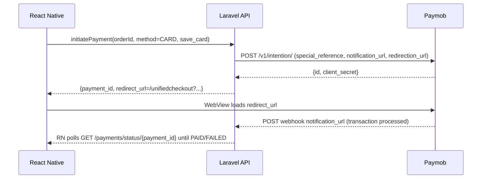

# Paymob Tokenization Integration Deep Review

## Executive summary and prioritized remediation checklist

Your implementation is **Laravel + MySQL + React Native (Expo Router + WebView)** and attempts to support **three Paymob stacks simultaneously**: legacy Accept iframe (auth → order → payment key → iframe), Intention + Unified Checkout (Secret Key → client_secret → `/unifiedcheckout`), and server‑to‑server MOTO token charges (`/api/acceptance/payments/pay`). Mixing them is possible, but the current codebase has **production‑blocking correctness issues**, **schema/code mismatches**, and **tokenization security flaws** (saving card tokens from an unverified “token webhook”).  

The Paymob Postman collection confirms the Intention request fields (`amount`, `payment_methods`, `items.amount`, `billing_data`, `special_reference`, `notification_url`, `redirection_url`) and MOTO contract (`source.identifier` + `payment_token`). citeturn15view0turn16view0

### Immediate P0 fixes

| Priority | What breaks | Where | What to do |
|---|---|---|---|
| P0 | **PHP parse error** | `PaymentMethod.php` ~188–191 | Remove stray braces inside the docblock; file is not deployable |
| P0 | **DB ↔ model mismatch causes webhook crashes** | `PaymobPayment.php` vs `paymob_payments` table | Align column names (`paymob_transaction_id` vs `transaction_id`; `error_message` vs `failure_reason`; missing `user_id`) |
| P0 | **Open DB transaction + early returns** | `PaymentController::initiatePayment` ~181–256 | Refactor to `DB::transaction()` or ensure commit/rollback on every path |
| P0 | **Unsafe tokenization** (forged token persistence) | `PaymentController::handleTokenWebhook` ~959–1058 + trait duplicate | Delete/disable token webhook persistence; only save token after verified transaction success citeturn17search0 |
| P0 | **MOTO uses wrong integration/payment token source** | `initiateMotoPayment` ~1524–1537 + `PaymobService::generatePaymentKey` ~122–146 | MOTO `payment_token` must be from **Intention under Moto integration ID** citeturn15view0 |
| P0 | **Broken method call** | `markAsFallbackTo3DS(string $reason)` called without arg (~1563) | Pass a reason or make it optional |
| P0 | **Encrypted token won’t fit DB** | `payment_methods.paymob_card_token varchar(255)` | Change to `TEXT`/`MEDIUMTEXT`; also make `token` nullable |

## Paymob official flow requirements and how your code should map

### Intention and Unified Checkout

Paymob’s Postman docs show (Egypt):
- `POST https://accept.paymob.com/v1/intention/` with:
  - `amount` (in cents), `currency`
  - `payment_methods` (integration IDs)
  - `items[].amount` (in cents)
  - `billing_data` (first/last/phone/email mandatory)
  - `special_reference` (returned later under `merchant_order_id`)
  - `notification_url` + `redirection_url` (cards; overlap integration callbacks) citeturn15view0  
- Unified Checkout URL: `https://accept.paymob.com/unifiedcheckout/?publicKey=<PublicKey>&clientSecret=<client_secret>` citeturn15view0

Your `PaymobService::createIntention()` matches this shape, but your **correlation** (`internal_reference = internalOrderId . '-' . uniqid()`) is not stored, so callback mapping becomes probabilistic.

### MOTO / Pay with saved token

Paymob’s Postman docs show:
- `POST https://accept.paymob.com/api/acceptance/payments/pay`
- Body:  
  - `source.identifier = <Card_Token>` (from save-card callback)  
  - `source.subtype = "TOKEN"`  
  - `payment_token = <Payment_Key>` **obtained from the intention request under the Moto integration ID** citeturn15view0

Your `payWithSavedCardMoto()` matches the request shape, but your **payment key generation** does not: you currently produce JWTs via legacy `/acceptance/payment_keys` and with the wrong integration selection.

### Transaction inquiry and region base URLs

Paymob’s inquiry docs provide:
- Auth token: `POST /api/auth/tokens` with `{ api_key }`.
- Inquiry by merchant reference: `POST /api/ecommerce/orders/transaction_inquiry` with `{ auth_token, merchant_order_id }`.
- Inquiry by txn id: `GET /api/acceptance/transactions/{transaction_ID}`.
They also list region base URLs (`accept.paymob.com`, `ksa.paymob.com`, `uae.paymob.com`, etc.). citeturn16view0

You should use these for “webhook fallback” instead of `GET /v1/intentions/{id}`.

## Detailed findings by file

### Backend Laravel code

#### `PaymentMethod.php`
- **Fatal parse error**: stray `}` inside docblock around **188–191** prevents PHP from loading the project.
- **Encryption vs schema mismatch**: `getPaymobCardTokenAttribute()` decrypts using `Crypt`, meaning stored ciphertext is much longer than 255 chars; schema uses `varchar(255)` for `paymob_card_token`.
- **Schema mismatch**: model sets `token` to null for new records, but SQL defines `payment_methods.token` as **NOT NULL**.

Recommended fix (conceptual):
- Make `token` nullable (legacy only).
- Make `paymob_card_token` `TEXT` and store only encrypted token.

#### `PaymobPayment.php` + `elbaraka_server.sql` (`paymob_payments`)
- Table columns: `paymob_transaction_id`, `error_message`; **no `user_id`**.  
- Model expects: `transaction_id`, `failure_reason`, `user_id`.  
This breaks:
- `markAsPaid()` updates non-existent `transaction_id` → will throw SQL errors during webhook processing.
- `checkStatus()` security guard uses `user_id` that isn’t stored.
- Any code updating `failure_reason` will fail.

**Fix direction**: either (A) rename DB columns to match model, or (B) change model/controller to match DB. For lowest risk, prefer **B** (update model + controller), then optionally do a later migration to normalize naming.

#### `PaymentController.php`
Key correctness/security issues (approx line ranges):
- **DB transaction leak**: `DB::beginTransaction()` at ~181, then early return for wallet/classic flow at ~248–255 without commit/rollback.
- **Redundant Paymob calls**: `authenticate()` + `registerOrder()` executed inside `initiatePayment()` (~222–230) but discarded for downstream flows; causes orphan Paymob orders and noise.
- **Authorization weakness**: `Order::findOrFail($request->order_id)` without verifying ownership; users can potentially initiate payment for someone else’s order. This is a classic payment gateway business‑logic flaw. citeturn17search0
- **Token webhook persistence is unsafe** (`handleTokenWebhook` ~959): logs token preview and stores token without authenticity proof; must be removed. Webhooks must be verified and idempotent. citeturn17search0turn17search2
- **MOTO integration error**: MOTO payment key must come from **Intention under Moto integration** (Paymob requirement), but you generate a “payment key” via `/acceptance/payment_keys` with card integration (`generatePaymentKey(...,'CARD')`). citeturn15view0
- **Broken call**: `markAsFallbackTo3DS()` called without required `$reason` (~1563).
- **Reference mapping is non-deterministic**: you send `special_reference = internalOrderId . '-' . uniqid()` (~1718) but don’t store it; webhook mapping falls back to prefix matching (`ORD-<id>%`) which can select the wrong attempt.

#### `PaymobService.php`
- `createIntention()` payload aligns with Paymob’s Intention docs (good). citeturn15view0
- `getTransactionByIntention()` uses `GET https://accept.paymob.com/v1/intentions/{id}` (plural); not supported by the Egypt inquiry docs you should rely on. Use `/transaction_inquiry` or `/acceptance/transactions/{id}`. citeturn16view0
- `generatePaymentKey()` only selects wallet vs card integration. You need **MOTO integration ID** as a third option if you keep legacy JWT payment keys (but Paymob expects MOTO payment_token from Intention). citeturn15view0
- Logging leaks: token previews and client_secret previews appear in logs; do not log secrets/tokens. citeturn17search2

#### `PaymentDecisionService.php`
- Uses `$order->total_cents` (~76, 79, 155) but DB order has `total decimal(10,2)` only; results in wrong/no flow decisions.

#### `PaymentControllerTokenHandler.php`
- Duplicate of token webhook logic; unused and should be deleted (redundancy).

### React Native frontend

You effectively have **two parallel WebView/payment modules**:

- `PaymentWebView.tsx` component: triggers polling **by orderId** (`getPaymentStatus(orderId)`), starts polling when it detects “post_pay/response” URLs.
- `payment-webview.tsx` screen: polls **by paymentId** using `pollPaymentStatus(paymentId, …)` and supports deep-link interception (`elbaraka://payment-return`).

This split is risky:
- Order-level polling becomes ambiguous when an order has multiple attempts.
- Different screens can disagree about terminal state or recovery.

**Recommendation**: delete/consolidate into the paymentId-based flow (`payment-webview.tsx`) and make backend return `payment_id + redirect_url` for every attempt.

### MySQL schema (`elbaraka_server.sql`)

Main issues:
- `payment_methods.token` is `NOT NULL` but new flow wants `paymob_card_token` (token should be nullable for legacy).
- `payment_methods.paymob_card_token varchar(255)` too small for encrypted payload.
- `paymob_payments` lacks `user_id` and uses `paymob_transaction_id` vs model’s `transaction_id`.

## Target enterprise-grade architecture, API contracts, and data model

### Canonical flows

```mermaid
flowchart TD
  A[Client: POST /payments/initiate] --> B[Backend: create paymob_payments attempt + stable special_reference]
  B --> C[Backend: POST /v1/intention/ with special_reference + notification_url + redirection_url]
  C --> D[Backend: return payment_id + unifiedcheckout URL]
  D --> E[RN WebView opens Unified Checkout]
  E --> F[Paymob -> notification_url webhook (authoritative)]
  F --> G[Backend verifies authenticity + idempotency]
  G --> H{success=true?}
  H -- yes --> I[Mark paymob_payments PAID + orders.payment_status=completed]
  I --> J{save_card_requested?}
  J -- yes --> K[Extract token object from verified callback, store payment_methods]
  H -- no --> L[Mark FAILED, keep cart/order retryable]
```



### API contracts (recommended)

- `POST /api/v1/payments/initiate`
  - Request: `{ order_id, payment_method: "CARD"|"WALLET", payment_method_id?, save_card?, billing_data }`
  - Response: `{ payment_id, flow: "unified_3ds"|"classic_iframe"|"moto", redirect_url }`

- `GET /api/v1/payments/status/{payment_id}`
  - Response: `{ status: PENDING|PAID|FAILED, order_payment_status, transaction_id, flow }`

- `GET /api/v1/payment-methods`
- `DELETE /api/v1/payment-methods/{id}`
- `POST /api/v1/payment-methods/{id}/default`

### Data model normalization

Minimum required columns:
- `paymob_payments.user_id` (FK to users)
- `paymob_payments.special_reference` (exact string sent to Paymob; unique)
- `paymob_payments.paymob_transaction_id` (unique, nullable until success)
- `payment_methods.paymob_card_token` as TEXT (encrypted)
- `payment_methods.token` nullable (legacy)

## Production configuration and secure deployment checklist

### Required Paymob credentials and where to get them

You will need:
- API Key, Secret Key, Public Key, HMAC key/secret, and Integration IDs (cards/wallet/MOTO, etc.). citeturn15view0turn16view0  
Independent platform docs (Odoo) also confirm selecting Test vs Live mode and retrieving HMAC/API/Public/Secret keys from dashboard settings. citeturn0search8

### Recommended `.env` entries

```env
PAYMOB_REGION=EGY
PAYMOB_BASE_URL=https://accept.paymob.com

PAYMOB_API_KEY=...
PAYMOB_SECRET_KEY=...
PAYMOB_PUBLIC_KEY=...
PAYMOB_HMAC_SECRET=...

PAYMOB_INTEGRATION_ID_CARD=...
PAYMOB_INTEGRATION_ID_WALLET=...
PAYMOB_INTEGRATION_ID_3DS=...
PAYMOB_INTEGRATION_ID_MOTO=...

PAYMOB_NOTIFICATION_URL=https://api.example.com/api/v1/payments/paymob/webhook
PAYMOB_REDIRECTION_URL=elbaraka://payment-return
```

Also keep region portability: Paymob documents different base URLs per region. citeturn16view0

### Secure deployment checklist

- **Secrets management**: store Paymob secrets in a secrets manager, rotate and limit access. citeturn17search1  
- **TLS**: webhook endpoints must be HTTPS; block plaintext.
- **Webhook verification**: verify Paymob callback signature/HMAC; reject invalid; enforce idempotency. citeturn17search0
- **Logging**: never log tokens, client_secret, payment JWTs; redact. citeturn17search2
- **Rate limiting**: rate-limit initiate/status endpoints; protect from abuse.
- **CORS**: only allow your RN/web origins for public APIs (webhooks should not need CORS).
- **Least privilege DB user** and encrypted backups.

### PCI/tokenization considerations

Tokenization reduces PAN exposure but does **not remove PCI obligations**; token systems still require strong security controls, key management, and monitoring guidance. citeturn17search3turn17search7

## Testing strategy, migrations, rollback, and risk assessment

### Recommended tests

- Unit
  - Correlation mapping: webhook payload `merchant_order_id` → correct `paymob_payments` row.
  - Idempotency: two identical webhooks do not double-fulfill.
  - Token persistence gating: token is saved only when `success=true` and `save_card_requested=true`.

- Integration (sandbox)
  - Intention creation payload validation per Paymob docs. citeturn15view0
  - MOTO payment uses `payments/pay` body exactly. citeturn15view0
  - Inquiry fallback via `/transaction_inquiry` and `/acceptance/transactions/{id}`. citeturn16view0

- E2E
  - RN: initiate → WebView → polling completion.
  - Recovery flow: resume pending payment.

### Sample Laravel migrations (critical)

```php
// 1) paymob_payments: add user_id + special_reference + align columns
Schema::table('paymob_payments', function (Blueprint $table) {
    $table->unsignedBigInteger('user_id')->nullable()->index();
    $table->string('special_reference', 128)->nullable()->unique();
    // Option A: keep paymob_transaction_id, update code/model to use it.
    // Option B: rename column to transaction_id (risky on MySQL without downtime planning).
});

// 2) payment_methods: make token nullable + widen paymob_card_token
Schema::table('payment_methods', function (Blueprint $table) {
    $table->text('token')->nullable()->change();
    $table->text('paymob_card_token')->nullable()->change();
});
```

### Sample webhook handler skeleton (secure pattern)

```php
public function paymobWebhook(Request $request): JsonResponse
{
    $data = $request->all();

    // 1) Verify authenticity (HMAC/signature)
    if (!$this->paymobService->verifyHmac($data)) {
        return response()->json(['message' => 'Invalid signature'], 403);
    }

    $payload = $data['obj'] ?? $data;
    $merchantRef = $payload['merchant_order_id']
        ?? ($payload['order']['merchant_order_id'] ?? null);

    // 2) Map deterministically
    $payment = PaymobPayment::where('special_reference', $merchantRef)->firstOrFail();

    // 3) Idempotency
    $txnId = $payload['id'] ?? null;
    if ($payment->status !== 'PENDING' || ($txnId && $payment->paymob_transaction_id === (string)$txnId)) {
        return response()->json(['message' => 'Already processed'], 200);
    }

    // 4) Update atomically
    DB::transaction(function () use ($payment, $payload, $txnId) {
        if (!($payload['success'] ?? false)) {
            $payment->update([
                'status' => 'FAILED',
                'paymob_response' => $payload,
                'error_message' => $payload['data']['message'] ?? 'Failed',
            ]);
            $payment->order->update(['payment_status' => 'failed']);
            return;
        }

        $payment->update([
            'status' => 'PAID',
            'paymob_transaction_id' => (string)$txnId,
            'paymob_response' => $payload,
            'paid_at' => now(),
        ]);
        $payment->order->update(['payment_status' => 'completed']);

        // Token save only AFTER verified success
        if ($payment->save_card_requested) {
            $this->saveCardToken($payment->user_id, $payload);
        }
    });

    return response()->json(['message' => 'OK'], 200);
}
```

### Rollback plan

- Keep legacy classic iframe flow behind a feature flag.
- If webhook verification/mapping fails in production, disable token-saving and fall back to classic iframe until fixed.
- Maintain a migration rollback script for schema changes affecting token columns.

### Risk assessment

- Highest risks: forged token persistence, order ownership bypass, and webhook processing failures from schema mismatch. These align with common third‑party payment integration failure modes. citeturn17search0